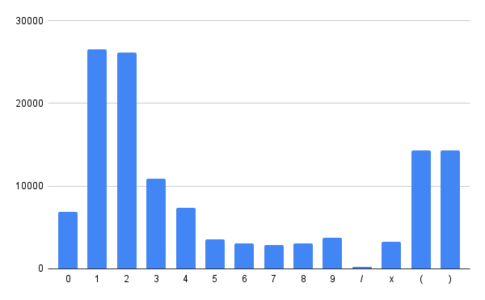
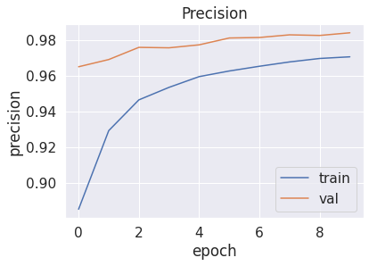
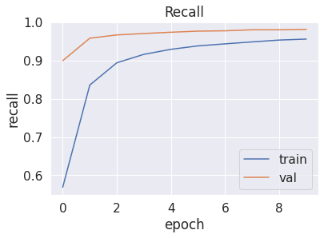
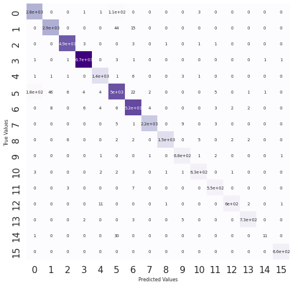
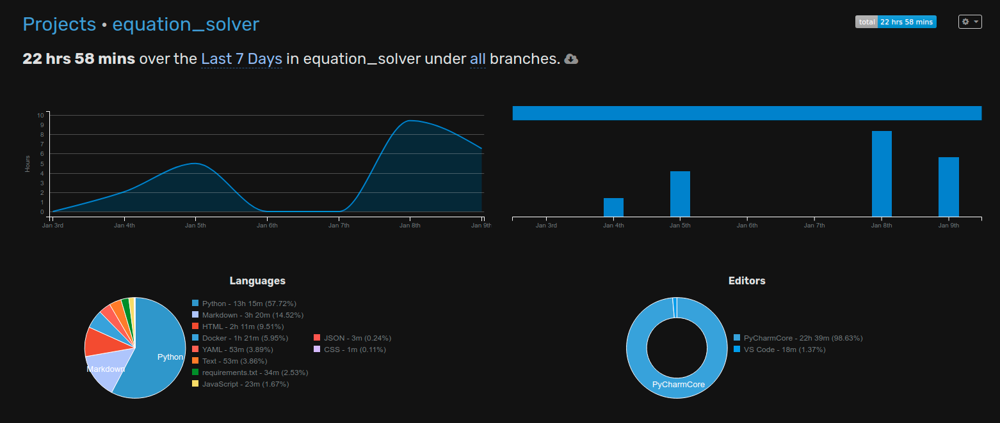

<h1>AI Equation Solver</h1>
<h2>Introduction</h2>

This program, given an image of a simple mathematical equation, extracts individual mathematical symbols 

using openCV, then using Tensorflow and a Convolutional model it classifies the characters. A python script 

is used to convert the characters into a mathematical equation. The characters are parsed without any external

libraries.

 

This application has a minimalistic frontend which allows for an image to be uploaded and sent to the server.

The server, implemented using flask, returns the parsed expression and the calculated result

 

Since there is a considerable number of dependencies, an image of this application can be found on Docker Hub.

I will discuss Docker in a different section

<h2>Usage</h2>

The application is designed to be used in a web browser. The frontend is a simple html page which allows for an image to be uploaded.

The image is then sent to the server which returns the parsed expression and the calculated result.

 

Because of a large number of dependencies, the most convenient way of using the application is with Docker

<b>I will provide three ways of using the application (one is using docker and two are using the local machine)</b>
 
<ul>
    
<h3><li>Using Docker</li></h3>

<b>NOTE:</b> To connect to the server using a machine on the local network(Phone, other laptop...) you must use the IP address of the machine hosting the sever. In other words, insead of localhost, the ip address of the device where the server was started must be entered. 
<a href="https://hub.docker.com/repository/docker/zovkoante23/equation-solver">Image on Docker Hub</a>
<pre>
// Using the CLI

// Download the image from Docker Hub
docker image pull zovkoante23/equation-solver

// Run the image
docker run -d -p 5000:5000 zovkoante23/equation-solver

// Open the browser
http://localhost:5000/

// Upload an image
</pre>

Alternatively, the image could be built using the Dockerfile

<pre>
// In the directory containing the Dockerfile

// Build the image
docker build -t zovkoante23/equation-solver .

// Run the image
docker run -d -p 5000:5000 zovkoante23/equation-solver

// Open the browser
http://localhost:5000/

// Upload an image

</pre>

<h3><li>Using the local machine (With Server)</li></h3>

<pre>
// Using the command line

// In the directory containing server.py

python3 app.py 

// Open the browser
http://localhost:5000

// Upload an image
</pre>

<h3><li>Using the local machine (Without Server)</li></h3>

<pre>
// Using the command line

// In the directory containing no_server_solver.py

// Using this command, the system will randomly choose an image from the Image_demo folder
python3 no_server_solver.py

// Using this command, the system will use the image specified in the command line
python3 no_server_solver.py --image_path=path/to/image.jpg

</pre>

</ul>
<h2>Machine Learning Model</h2>

In the sections above, I have discussed how the application is implemented and how to use it.
Now, I will describe how the machine learning model is implemented, different metrics, and possible improvements.

<h3>Dataset</h2>
The dataset used for this application was obtained from Kaggle. The dataset consists of images of mathematical equations.

The dataset can be found here: <a href="https://www.kaggle.com/xainano/handwrittenmathsymbols">Handwritten Math Symbols</a>

The dataset originally came in with a significant number of classes, but I have only kept the numbers and the most basic operations which
is 16 classes in total.

<b>The classes are:</b>

<pre>[(', ')', '+', '-', '0', '1', '2', '3', '4', '5', '6', '7', '8', '9','/', 'x']</pre>

The number of images for each class varies significantly which is why the model performs better on some classification problems than others.
 
 

<b>Figure 1:</b> This figure shows the number of images for each dataset.

As can be seen, the number of images for each class is significantly different. "Number 2" has a very high number of images which is why, during testing, the that number sems to work best with the model

"Number 1" also has a very high number of images, however, because of the contour algorithm with openCV, it is not able to be classified correctly.
The contour algorithm finds contours in images and exports them as a cropped image
However, it is because of the noise from things it could detect as contours, I had to implement a width and height limit. The "number one" is too thin to be recognized by the algorithm.
   
<h3>Model</h3>
The model used for this application is a convolutional neural network. It has an input layer, 3 convolutional layers with max pooling, and an output layer.
 

Detailed view of the model:
 

<pre>
 Layer (type)                Output Shape              Param #   
=================================================================
 conv2d (Conv2D)             (None, 44, 44, 32)        160       
                                                                 
 activation (Activation)     (None, 44, 44, 32)        0         
                                                                 
 max_pooling2d (MaxPooling2D  (None, 22, 22, 32)       0         
 )                                                               
                                                                 
 conv2d_1 (Conv2D)           (None, 21, 21, 32)        4128      
                                                                 
 activation_1 (Activation)   (None, 21, 21, 32)        0         
                                                                 
 max_pooling2d_1 (MaxPooling  (None, 10, 10, 32)       0         
 2D)                                                             
                                                                 
 conv2d_2 (Conv2D)           (None, 9, 9, 64)          8256      
                                                                 
 activation_2 (Activation)   (None, 9, 9, 64)          0         
                                                                 
 max_pooling2d_2 (MaxPooling  (None, 4, 4, 64)         0         
 2D)                                                             
                                                                 
 flatten (Flatten)           (None, 1024)              0         
                                                                 
 dense (Dense)               (None, 64)                65600     
                                                                 
 activation_3 (Activation)   (None, 64)                0         
                                                                 
 dropout (Dropout)           (None, 64)                0         
                                                                 
 dense_1 (Dense)             (None, 16)                1040      
                                                                 
 activation_4 (Activation)   (None, 16)                0         
                                                                 
=================================================================
Total params: 79,184
Trainable params: 79,184
Non-trainable params: 0
_________________________________________________________________

</pre>
<b> NOTE: A plot of summary can be seen in the "Plots/Model_Plot.png" image</b>

 

The summary of the training process:
<pre>
Epoch 1/10
1160/1160 [==============================] - 78s 57ms/step - loss: 1.1347 - categorical_accuracy: 0.6590 - precision_1: 0.8854 - recall_1: 0.5686 - true_negatives_1: 2214658.0000 - true_positives_1: 84363.0000 - false_negatives_1: 64009.0000 - false_positives_1: 10922.0000 - val_loss: 0.2367 - val_categorical_accuracy: 0.9387 - val_precision_1: 0.9649 - val_recall_1: 0.8999 - val_true_negatives_1: 555182.0000 - val_true_positives_1: 33380.0000 - val_false_negatives_1: 3713.0000 - val_false_positives_1: 1213.0000
Epoch 2/10
1160/1160 [==============================] - 65s 56ms/step - loss: 0.3958 - categorical_accuracy: 0.8728 - precision_1: 0.9293 - recall_1: 0.8361 - true_negatives_1: 2216138.0000 - true_positives_1: 124051.0000 - false_negatives_1: 24321.0000 - false_positives_1: 9442.0000 - val_loss: 0.1327 - val_categorical_accuracy: 0.9631 - val_precision_1: 0.9690 - val_recall_1: 0.9588 - val_true_negatives_1: 555256.0000 - val_true_positives_1: 35563.0000 - val_false_negatives_1: 1530.0000 - val_false_positives_1: 1139.0000
Epoch 3/10
1160/1160 [==============================] - 65s 56ms/step - loss: 0.2631 - categorical_accuracy: 0.9166 - precision_1: 0.9464 - recall_1: 0.8944 - true_negatives_1: 2218071.0000 - true_positives_1: 132711.0000 - false_negatives_1: 15661.0000 - false_positives_1: 7509.0000 - val_loss: 0.1006 - val_categorical_accuracy: 0.9710 - val_precision_1: 0.9758 - val_recall_1: 0.9673 - val_true_negatives_1: 555504.0000 - val_true_positives_1: 35881.0000 - val_false_negatives_1: 1212.0000 - val_false_positives_1: 891.0000
Epoch 4/10
1160/1160 [==============================] - 66s 56ms/step - loss: 0.2106 - categorical_accuracy: 0.9324 - precision_1: 0.9534 - recall_1: 0.9165 - true_negatives_1: 2218938.0000 - true_positives_1: 135984.0000 - false_negatives_1: 12388.0000 - false_positives_1: 6642.0000 - val_loss: 0.0926 - val_categorical_accuracy: 0.9730 - val_precision_1: 0.9755 - val_recall_1: 0.9710 - val_true_negatives_1: 555491.0000 - val_true_positives_1: 36019.0000 - val_false_negatives_1: 1074.0000 - val_false_positives_1: 904.0000
Epoch 5/10
1160/1160 [==============================] - 67s 58ms/step - loss: 0.1809 - categorical_accuracy: 0.9425 - precision_1: 0.9594 - recall_1: 0.9297 - true_negatives_1: 2219748.0000 - true_positives_1: 137936.0000 - false_negatives_1: 10436.0000 - false_positives_1: 5832.0000 - val_loss: 0.0860 - val_categorical_accuracy: 0.9756 - val_precision_1: 0.9772 - val_recall_1: 0.9744 - val_true_negatives_1: 555551.0000 - val_true_positives_1: 36143.0000 - val_false_negatives_1: 950.0000 - val_false_positives_1: 844.0000
Epoch 6/10
1160/1160 [==============================] - 65s 56ms/step - loss: 0.1590 - categorical_accuracy: 0.9491 - precision_1: 0.9626 - recall_1: 0.9386 - true_negatives_1: 2220166.0000 - true_positives_1: 139268.0000 - false_negatives_1: 9104.0000 - false_positives_1: 5414.0000 - val_loss: 0.0696 - val_categorical_accuracy: 0.9790 - val_precision_1: 0.9810 - val_recall_1: 0.9772 - val_true_negatives_1: 555693.0000 - val_true_positives_1: 36249.0000 - val_false_negatives_1: 844.0000 - val_false_positives_1: 702.0000
Epoch 7/10
1160/1160 [==============================] - 64s 55ms/step - loss: 0.1451 - categorical_accuracy: 0.9533 - precision_1: 0.9652 - recall_1: 0.9440 - true_negatives_1: 2220533.0000 - true_positives_1: 140057.0000 - false_negatives_1: 8315.0000 - false_positives_1: 5047.0000 - val_loss: 0.0680 - val_categorical_accuracy: 0.9793 - val_precision_1: 0.9813 - val_recall_1: 0.9781 - val_true_negatives_1: 555703.0000 - val_true_positives_1: 36281.0000 - val_false_negatives_1: 812.0000 - val_false_positives_1: 692.0000
Epoch 8/10
1160/1160 [==============================] - 64s 55ms/step - loss: 0.1331 - categorical_accuracy: 0.9572 - precision_1: 0.9676 - recall_1: 0.9491 - true_negatives_1: 2220870.0000 - true_positives_1: 140814.0000 - false_negatives_1: 7558.0000 - false_positives_1: 4710.0000 - val_loss: 0.0601 - val_categorical_accuracy: 0.9815 - val_precision_1: 0.9828 - val_recall_1: 0.9808 - val_true_negatives_1: 555757.0000 - val_true_positives_1: 36380.0000 - val_false_negatives_1: 713.0000 - val_false_positives_1: 638.0000
Epoch 9/10
1160/1160 [==============================] - 64s 55ms/step - loss: 0.1223 - categorical_accuracy: 0.9612 - precision_1: 0.9696 - recall_1: 0.9539 - true_negatives_1: 2221138.0000 - true_positives_1: 141528.0000 - false_negatives_1: 6844.0000 - false_positives_1: 4442.0000 - val_loss: 0.0589 - val_categorical_accuracy: 0.9814 - val_precision_1: 0.9824 - val_recall_1: 0.9807 - val_true_negatives_1: 555744.0000 - val_true_positives_1: 36378.0000 - val_false_negatives_1: 715.0000 - val_false_positives_1: 651.0000
Epoch 10/10
1160/1160 [==============================] - 64s 55ms/step - loss: 0.1150 - categorical_accuracy: 0.9628 - precision_1: 0.9705 - recall_1: 0.9565 - true_negatives_1: 2221265.0000 - true_positives_1: 141913.0000 - false_negatives_1: 6459.0000 - false_positives_1: 4315.0000 - val_loss: 0.0558 - val_categorical_accuracy: 0.9829 - val_precision_1: 0.9839 - val_recall_1: 0.9819 - val_true_negatives_1: 555799.0000 - val_true_positives_1: 36423.0000 - val_false_negatives_1: 670.0000 - val_false_positives_1: 596.0000

</pre>

It is a very standard CNN model with relu activation functions and at the end a softmax function.
It was trained using a <b>GPU</b> provided by Google on Google Collab. 

<h3>Metrics</h3>
In this section, I will show some metrics recorded while training and testing the model and then discuss them.

<h4>Accuracy</h4>

<b>Figure 2:</b> This figure shows the accuracy vs epoch plot
<h4>Precision and Recall</h4>

<b>Figure 3:</b> This figure shows the precision and recall vs epoch plot

 
 

<h4>Confusion Matrix</h4>

<b>Figure 4:</b> This figure shows the confusion matrix
 <b>NOTE: </b> The numbers in the matrix correspond to the index of these items:
<pre>
Matrix Labels
[ 0 ,  1 ,  2 ,  3 ,  4 ,  5 ,  6 ,  7 ,  8 ,  9 ,  10 , 11,  12,  13,  14,  15]

Actual Values:
['(', ')', '+', '-', '0', '1', '2', '3', '4', '5', '6', '7', '8', '9', '/', 'x']
</pre>

 
<b>NOTE: </b> The individual true/false positives and negatives plots can be accessed in the "Plots" directory

<h2>Discussion and Analysis</h2>
The model is very powerful. The metrics look satisfactory. From the figures, it can be inferred that the model
started to converge after epoch 3-4. 

From the confusion matrix it can be seen that the "/" is the hardest to recognize for the model.
This is consistent with my own observations while testing the application and also from observations in Figure 1. The number of images in the "/" is much lower than
for any other class. 

Other than problems with the "/", the model is very accurate.
Another problem I discovered while testing is that the model tends to classify any symbol with a round portion as "0".
This includes 8, 9, and 6. However, in the confusion matrix, other than a small increase when it predicts "0" when it is "8", there is no significant proof for my observation.
This leads me to believe that my technique of writing digits is different from the way the model has learned it.

While it has some flaws, the model in this application is fairly robust.
One of the bigger problems faced was extracting the data for the model to use.

The current algorithm for extracting characters to feed into the model is:
<pre>
// Load image
// Eliminate Shadows
// Convert to grayscale
// Perform a gaussian blur to eliminate noise
// Use threshold function to convert to binary image
// Perform an erosion to fill gaps
// Extract contours
// Perform a dilation to reduce thickness for better model accuracy
// Save Contours in a folder
</pre>

The biggest difficulty faced was noise. I have managed to significantly reduce it using the algorithm above.

Another difficulty faced was parsing. There was no way to test logic for parsing "(" and ")" since the algorithm is unable to extract them, so I removed it.
The algorithm for parsing currently appends numbers to a string until it finds an operator, then it performs the operation
and continues to search

<h2>Proposed Improvements</h2>

The biggest improvements could be made in the algorithm for extracting characters and dataset.
The dataset should include more images for certain classes.

Preprocessing the images would significantly improve performance as it would make it more general.

The parsing and extracting should support parentheses

Better algorithm for extracting contours like for example when detecting a minus sign, the contour is very small around it so when the
image is given to the model, it has to be stretched and the model cannot recognize it (Same issue with "1" except it's horizontally)

<h2>Conclusion</h2>

This project has been fun and challenging. I have learned a lot, especially about image processing in openCV.

I have learned a lot about machine learning and how to use it in this application.

I have improved my knowledge of docker, web services like flask and sending data through APIs

<h2>Misc</h2>

The number of hours spent on this project and some other info (Tracked using the WakaTime plugin)

